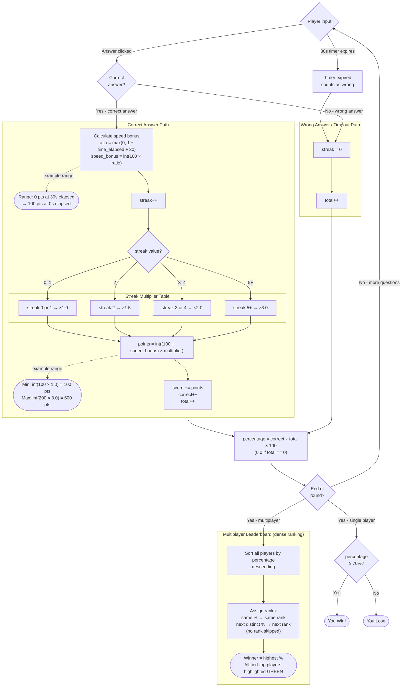

# Scoring Logic — Python Trivia App

**Generated:** 2026-06-09

```mermaid
flowchart TD
    INPUT{Player input} -->|Answer clicked| ANS{Correct\nanswer?}
    INPUT -->|30s timer expires| EXPIRED

    EXPIRED[Timer expired\ncounts as wrong] --> STREAK_RESET

    ANS -->|No - wrong answer| STREAK_RESET
    ANS -->|Yes - correct answer| SPEED

    subgraph CORRECT["Correct Answer Path"]
        SPEED["Calculate speed bonus\nratio = max(0, 1 − time_elapsed ÷ 30)\nspeed_bonus = int(100 × ratio)"]
        SPEED_RANGE(["Range: 0 pts at 30s elapsed\n→ 100 pts at 0s elapsed"])
        SPEED -.->|example range| SPEED_RANGE

        STREAK_INC["streak++"]
        SPEED --> STREAK_INC

        STREAK_INC --> MULT_CHECK{streak value?}

        subgraph MULT["Streak Multiplier Table"]
            M1["streak 0 or 1 → ×1.0"]
            M2["streak 2 → ×1.5"]
            M3["streak 3 or 4 → ×2.0"]
            M4["streak 5+ → ×3.0"]
        end

        MULT_CHECK -->|0–1| M1
        MULT_CHECK -->|2| M2
        MULT_CHECK -->|3–4| M3
        MULT_CHECK -->|5+| M4

        CALC["points = int((100 + speed_bonus) × multiplier)"]
        M1 --> CALC
        M2 --> CALC
        M3 --> CALC
        M4 --> CALC

        CALC_RANGE(["Min: int(100 × 1.0) = 100 pts\nMax: int(200 × 3.0) = 600 pts"])
        CALC -.->|example range| CALC_RANGE

        UPDATE_CORRECT["score += points\ncorrect++\ntotal++"]
        CALC --> UPDATE_CORRECT
    end

    subgraph WRONG["Wrong Answer / Timeout Path"]
        STREAK_RESET["streak = 0"]
        UPDATE_WRONG["total++"]
        STREAK_RESET --> UPDATE_WRONG
    end

    UPDATE_CORRECT --> PERCENTAGE
    UPDATE_WRONG --> PERCENTAGE

    PERCENTAGE["percentage = correct ÷ total × 100\n(0.0 if total == 0)"]

    PERCENTAGE --> VERDICT{End of\nround?}
    VERDICT -->|No - more questions| INPUT
    VERDICT -->|Yes - single player| WIN{percentage\n≥ 70%?}
    VERDICT -->|Yes - multiplayer| RANK

    WIN -->|Yes| YOU_WIN(["You Win!"])
    WIN -->|No| YOU_LOSE(["You Lose"])

    subgraph LEADERBOARD["Multiplayer Leaderboard (dense ranking)"]
        RANK["Sort all players by percentage\ndescending"]
        DENSE["Assign ranks:\nsame % → same rank\nnext distinct % → next rank\n(no rank skipped)"]
        RANK --> DENSE
        DENSE --> WINNER(["Winner = highest %\nAll tied-top players highlighted GREEN"])
    end
```
