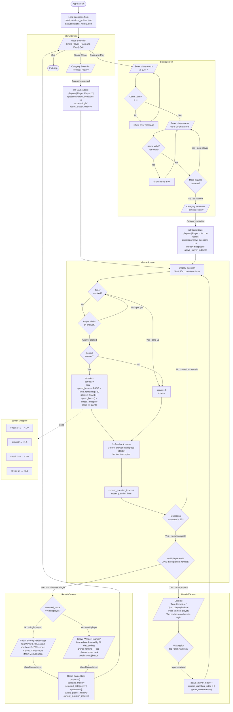

# Screen Flow — Python Trivia App

**Generated:** 2026-06-09

```mermaid
flowchart TD
    START([App Launch]) --> LOAD[Load questions from\ndata/questions_politics.json\ndata/questions_history.json]
    LOAD --> MENU_MODE

    subgraph MENU["MenuScreen"]
        MENU_MODE[/"Mode Selection\nSingle Player | Pass-and-Play | Quit"/]
        MENU_CAT[/"Category Selection\nPolitics | History"/]
        MENU_MODE -->|Single Player| MENU_CAT
        MENU_MODE -->|Quit| EXIT([Exit App])
    end

    subgraph SETUP["SetupScreen"]
        SETUP_COUNT[/"Enter player count\n2, 3, or 4"/]
        SETUP_VALID{Count valid?\n2–4}
        SETUP_ERR1[Show error message]
        SETUP_NAMES[/"Enter player name\nup to 20 characters"/]
        SETUP_NAME_VALID{Name valid?\nnot empty}
        SETUP_ERR2[Show name error]
        SETUP_MORE{More players\nto name?}
        SETUP_CAT[/"Category Selection\nPolitics | History"/]

        SETUP_COUNT --> SETUP_VALID
        SETUP_VALID -->|No| SETUP_ERR1 --> SETUP_COUNT
        SETUP_VALID -->|Yes| SETUP_NAMES
        SETUP_NAMES --> SETUP_NAME_VALID
        SETUP_NAME_VALID -->|No| SETUP_ERR2 --> SETUP_NAMES
        SETUP_NAME_VALID -->|Yes| SETUP_MORE
        SETUP_MORE -->|Yes - next player| SETUP_NAMES
        SETUP_MORE -->|No - all named| SETUP_CAT
    end

    subgraph GAME["GameScreen"]
        GAME_Q[Display question\nStart 30s countdown timer]
        GAME_EXPIRED{Timer\nexpired?}
        GAME_INPUT{Player clicks\nan answer?}
        GAME_CORRECT{Correct\nanswer?}
        GAME_HIT["streak++\ncorrect++\ntotal++\nspeed_bonus = BASE × time_remaining / 30\npoints = (BASE + speed_bonus) × streak_multiplier\nscore += points"]
        GAME_MISS[streak = 0\ntotal++]
        GAME_PAUSE[1s feedback pause\nCorrect answer highlighted GREEN\nNo input accepted]
        GAME_ADV[current_question_index++\nReset question timer]
        GAME_CHECK{Questions\nanswered = 10?}
        GAME_MORE{Multiplayer mode\nAND more players remain?}

        GAME_Q --> GAME_EXPIRED
        GAME_EXPIRED -->|No| GAME_INPUT
        GAME_INPUT -->|No input yet| GAME_EXPIRED
        GAME_EXPIRED -->|Yes - time up| GAME_MISS
        GAME_INPUT -->|Answer clicked| GAME_CORRECT
        GAME_CORRECT -->|Yes| GAME_HIT
        GAME_CORRECT -->|No| GAME_MISS
        GAME_HIT --> GAME_PAUSE
        GAME_MISS --> GAME_PAUSE
        GAME_PAUSE --> GAME_ADV
        GAME_ADV --> GAME_CHECK
        GAME_CHECK -->|No - questions remain| GAME_Q
        GAME_CHECK -->|Yes - round complete| GAME_MORE
    end

    subgraph MULT["Streak Multiplier"]
        M1["streak 0–1 → ×1.0"]
        M2["streak 2 → ×1.5"]
        M3["streak 3–4 → ×2.0"]
        M4["streak 5+ → ×3.0"]
    end

    subgraph HANDOFF["HandoffScreen"]
        HO_SHOW[/"Display:\n'Turn Complete!'\n'{curr player} is done'\n'Pass to {next player}'\n'Tap or click anywhere to begin'"/]
        HO_WAIT{Waiting for\ntap / click / any key}
        HO_ADV["active_player_index++\ncurrent_question_index = 0\ngame_screen.reset()"]

        HO_SHOW --> HO_WAIT
        HO_WAIT -->|Input received| HO_ADV
    end

    subgraph RESULTS["ResultsScreen"]
        RES_MODE{selected_mode\n== multiplayer?}
        RES_SINGLE[/"Show: Score | Percentage\nYou Win! if ≥70% correct\nYou Lose if &lt;70% correct\nCorrect / Total count\n[Main Menu] button"/]
        RES_MULTI[/"Show: 'Winner: {name}!'\nLeaderboard sorted by % descending\nDense ranking — tied players share rank\n[Main Menu] button"/]
        RES_RESET["Reset GameState:\nplayers=[] | selected_mode=''\nselected_category='' | questions=[]\nactive_player_index=0\ncurrent_question_index=0"]

        RES_MODE -->|No - single player| RES_SINGLE
        RES_MODE -->|Yes - multiplayer| RES_MULTI
        RES_SINGLE -->|Main Menu clicked| RES_RESET
        RES_MULTI -->|Main Menu clicked| RES_RESET
    end

    MENU_MODE -->|Pass-and-Play| SETUP_COUNT
    MENU_CAT -->|Category selected| SINIT["Init GameState:\nplayers=[Player 'Player 1']\nquestions=draw_questions 10\nmode='single'\nactive_player_index=0"]
    SINIT --> GAME_Q

    SETUP_CAT -->|Category selected| MINIT["Init GameState:\nplayers=[Player n for n in names]\nquestions=draw_questions 10\nmode='multiplayer'\nactive_player_index=0"]
    MINIT --> GAME_Q

    GAME_HIT -.->|uses| MULT

    GAME_MORE -->|Yes - more players| HO_SHOW
    GAME_MORE -->|No - last player or single| RES_MODE

    HO_ADV --> GAME_Q

    RES_RESET --> MENU_MODE
```
